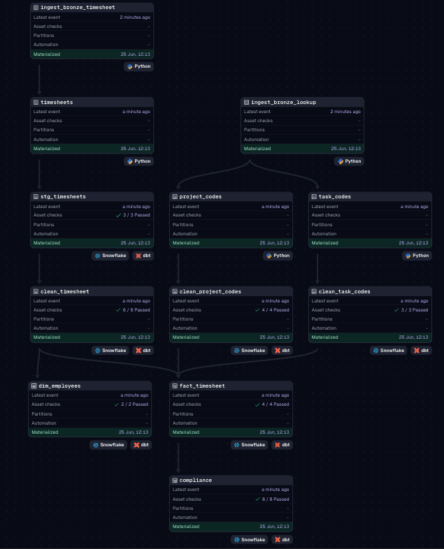

# Timesheet Compliance Pipeline

The pipeline takes raw employee timesheet exports, lands them in S3, loads them into Snowflake, runs a set of dbt transformations to clean and model the data, and ends with a Power BI dashboard tracking compliance KPIs across teams.

---

## Architecture

```
CSV Files (local)
      │
      ▼
┌─────────────────┐
│  Dagster Asset  │  Python · Polars
│  (Ingestion)    │  Reads & categorises raw timesheets
└────────┬────────┘
         │ Upload as Parquet (timestamped)
         ▼
┌─────────────────┐
│    AWS S3       │  Bronze layer (raw Parquet files)
│  Data Lake      │
└────────┬────────┘
         │ TRUNCATE + COPY INTO via external stage
         ▼
┌─────────────────┐
│   Snowflake     │  Cloud data warehouse
│  (Bronze Layer) │  Key-pair auth, credentials from Secrets Manager
└────────┬────────┘
         │
         ▼
┌─────────────────────────────────────────────┐
│              dbt Transformations            │
│                                             │
│  Staging → Silver → Gold → Mart             │
│ (rename)  (clean)  (model) (compliance)     │
└────────┬────────────────────────────────────┘
         │
         ▼
┌─────────────────┐
│   Power BI      │  Compliance KPI dashboard
│   Dashboard     │
└─────────────────┘
```

All assets are orchestrated by **Dagster**, wired together through the asset graph so dependencies are explicit and each materialisation records row counts and data previews as metadata.



---

## Tech Stack

| Layer | Technology |
|-------|------------|
| Orchestration | Dagster |
| Ingestion | Python, Polars, Boto3 |
| Data Lake | AWS S3 |
| Data Warehouse | Snowflake |
| Transformation | dbt Core + dbt_utils |
| Secrets Management | AWS Secrets Manager |
| Visualisation | Power BI |

---

## Source Data

The source system exports timesheets in a **wide format**: one row per employee per project/task combination, with 52 individual week columns (one per Monday of the year, e.g. `5-Jan`, `12-Jan`, ..., `28-Dec`). Each export also represents a different submission state:

| File | Category tag | Meaning |
|------|-------------|---------|
| `timesheet_full_year_2026.csv` | `full` → `submitted` | Fully submitted timesheets |
| `timesheet_missing_timecards_2026.csv` | `missing` → `not_submitted` | Weeks with no timecard at all |
| `timesheet_saved_not_submitted_2026.csv` | `saved` → `created_not_submitted` | Timecards saved as drafts but not submitted |

During ingestion, all three files are read and concatenated into a single Parquet upload with a `category` column added. The category column flows through every layer and is what drives the compliance scoring downstream.

---

## Data Model

### dbt Layers

```
bronze (Snowflake raw tables)
  └── staging/
        └── stg_timesheets          ← Rename the 52 week columns to snake_case (week_05_jan, etc.)
  └── silver/
        ├── clean_timesheet         ← Unpivot wide→long, type cast, map category labels,
        │                             parse week dates, deduplicate on (employee, week, project, task)
        ├── clean_project_codes     ← Project code lookup (code → name)
        └── clean_task_codes        ← Task code lookup (code → Capex/Opex classification)
  └── gold/
        ├── fact_timesheet          ← Joins clean_timesheet with both lookups;
        │                             adds project_hours (excludes Admin rows)
        └── dim_employees           ← Unique employees with manager and cost centre
  └── mart/
        └── compliance              ← Aggregates to employee-week grain, computes
                                      ratios and flags, outputs a compliance score
```

A few things worth calling out:

- The **unpivot** in `clean_timesheet` uses `dbt_utils.unpivot` to turn the 52 week columns into rows. Without this the compliance logic would need to be written 52 times.
- **Deduplication** in `clean_timesheet` uses a `qualify row_number()` window — if the same employee/week/project/task appears across multiple export files, the most recently ingested row wins.
- The **category mapping** happens in silver (`full → submitted`, `missing → not_submitted`, `saved → created_not_submitted`) so gold and mart always work with clean label values.

### Compliance Scoring Logic

Each employee-week is evaluated against three dimensions:

| Flag | Rule |
|------|------|
| `time_ok` | Total hours between 35–41 and no non-submitted entries |
| `mix_ok` | Capex ratio 10–30% and Opex ratio 70–90% — or a full leave week (37.5 / 40 hrs leave) |
| `admin_ok` | Admin hours ≤ 20 and no non-submitted entries |

**Final score:** `2` = fully compliant · `1` = submitted but at least one rule failed · `0` = has non-submitted entries

---

## Project Structure

```
├── prod_pipeline/                  # Dagster pipeline
│   ├── assets/
│   │   └── timesheet_tracker/
│   │       ├── assets_ingest_bronze_timesheet.py   # Reads CSVs, adds metadata cols, uploads to S3
│   │       ├── assets_copy_into_snowflake.py       # TRUNCATE + COPY INTO bronze tables
│   │       ├── assets_dbt_transformation.py        # Runs dbt build via DbtCliResource
│   │       ├── generate.py                         # Synthetic data generator (see below)
│   │       ├── csv_files/                          # Raw timesheet CSVs (input)
│   │       └── lookup_files/                       # Project & task code lookup CSVs
│   ├── resources/
│   │   └── dbt_resource.py                         # DbtCliResource config
│   └── utils/
│       ├── datalakeclient.py                       # S3 wrapper (upload, download, list)
│       └── snowflakeclient.py                      # Snowflake wrapper (key-pair auth)
│
├── dbt/timesheet_tracker/          # dbt project
│   ├── models/
│   │   ├── staging/
│   │   ├── silver/
│   │   ├── gold/
│   │   └── mart/
│   ├── macros/
│   │   └── generate_schema_name.sql
│   └── packages.yml                # dbt_utils dependency
│
├── requirements.txt
└── workspace.yaml
```

---

## Synthetic Data Generator

`generate.py` produces realistic demo CSVs so the pipeline can be run end-to-end without real data. It creates 20 employees across 3 teams (Sarah Mitchell / David Okafor / Rachel Burns), each assigned a fixed set of projects and tasks. Hours are randomised per week with intentional compliance violations seeded in — missing weeks, wrong Capex/Opex splits, draft-only saves — so the dashboard has something meaningful to show.

The script outputs all three CSV types (`full_year`, `missing_timecards`, `saved_not_submitted`) matching exactly what the real system would export.

---

## Setup & Running Locally

### Prerequisites

- Python 3.11+
- AWS credentials configured (`~/.aws/credentials` or IAM role)
- Snowflake account with key-pair auth — both the connection credentials and the PEM private key stored as separate secrets in AWS Secrets Manager
- dbt profile at `~/.dbt/profiles.yml`

### 1. Install dependencies

```bash
pip install -r requirements.txt
```

### 2. Generate demo data (optional)

```bash
python prod_pipeline/assets/timesheet_tracker/generate.py
```

### 3. Install dbt packages

```bash
cd dbt/timesheet_tracker
dbt deps
```

### 4. Launch Dagster

```bash
dagster dev
```

Open `http://localhost:3000`, go to the **Assets** tab, and materialise the `timesheet_pipeline` group in order:

1. `ingest_bronze_lookup` + `ingest_bronze_timesheet`
2. `copy_project_codes_into_snowflake` + `copy_timesheets_into_snowflake`
3. `transform_timesheet` (runs the full dbt build)

---

## Dashboard

The Power BI dashboard connects directly to Snowflake and shows:

- Weekly compliance rate by team and employee
- Capex / Opex split over time
- Submission status breakdown (submitted vs. draft vs. missing)
- Admin hours distribution
- Compliance score breakdown (0 / 1 / 2)

> **Note:** Video walkthrough available [here — add your Loom link].

---
